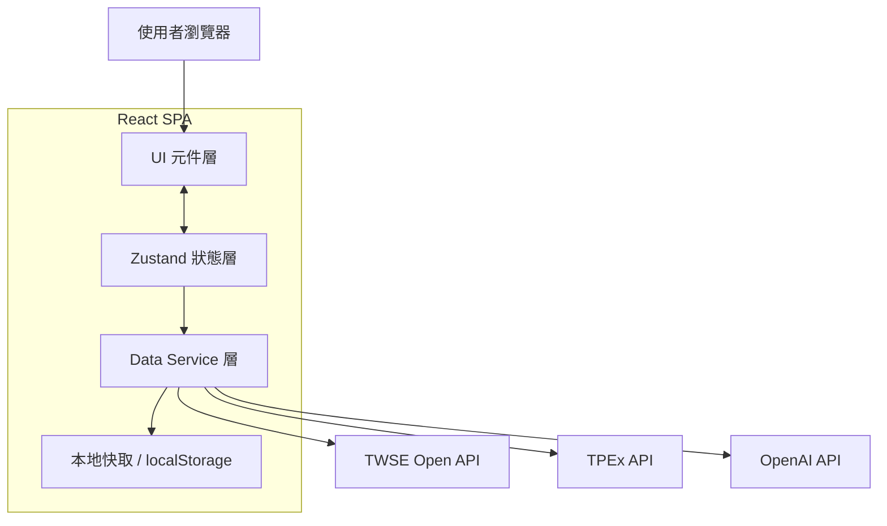
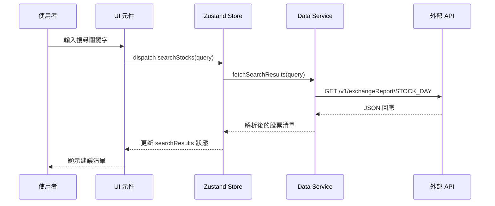
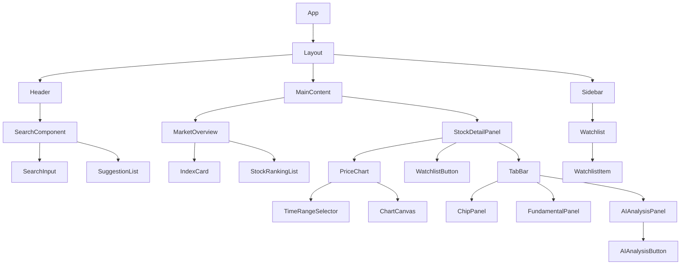

# 技術設計文件

## 概覽

台灣股票查詢網頁應用程式（Taiwan Stock Query App）是一個純前端的單頁應用程式（SPA），使用 React + TypeScript 建構，透過公開的台灣股市 API 取得即時與歷史股票資料。應用程式提供股票搜尋、即時報價、歷史走勢圖、自選股管理與市場總覽等功能，並支援桌面、平板與手機三種響應式版面。

### 技術選型

| 層次 | 技術 |
|------|------|
| 框架 | React 18 + TypeScript |
| 狀態管理 | Zustand |
| 圖表 | Recharts |
| HTTP 客戶端 | Axios |
| 樣式 | Tailwind CSS |
| 建構工具 | Vite |
| 測試 | Vitest + fast-check（PBT） |
| 股票資料 API | TWSE Open API / 台灣證券交易所公開資料 |
| AI API | OpenAI API（或相容 API，如 Azure OpenAI） |

### 外部 API 說明

本應用程式使用以下公開 API：

- **TWSE Open API**（`https://openapi.twse.com.tw`）：提供上市股票即時報價、成交量排行、漲跌幅排行、加權指數等資料
- **TWSE 歷史資料 API**（`https://www.twse.com.tw/exchangeReport/STOCK_DAY`）：提供個股日線歷史資料
- **TPEx API**（`https://www.tpex.org.tw`）：提供上櫃股票資料
- **TWSE 三大法人買賣超 API**（`https://www.twse.com.tw/fund/T86`）：提供外資、投信、自營商當日買賣超資料
- **TWSE 融資融券 API**（`https://www.twse.com.tw/exchangeReport/MI_MARGN`）：提供融資融券餘額與增減資料
- **TWSE 基本面資料**（`https://openapi.twse.com.tw/v1/exchangeReport/BWIBBU_d`）：提供本益比、股價淨值比等基本面指標
- **OpenAI API**（`https://api.openai.com/v1/chat/completions`）：提供 AI 智能分析服務，使用 GPT-4o 或相容模型；API Key 透過環境變數 `VITE_OPENAI_API_KEY` 注入，不得硬編碼於原始碼中

---

## 架構

### 整體架構圖



### 資料流



---

## 元件與介面

### 元件樹



### 主要元件介面

#### SearchComponent

```typescript
interface SearchComponentProps {
  onStockSelect: (stock: StockSummary) => void;
}
```

- 內部維護 `query` 狀態與 debounce（500ms）邏輯
- 呼叫 `useSearchStore` 取得 `suggestions` 與 `isLoading`

#### StockDetailPanel

```typescript
interface StockDetailPanelProps {
  stockId: string | null;
}
```

- 當 `stockId` 為 null 時顯示空白提示
- 從 `useStockStore` 取得 `currentStock` 資料

#### PriceChart

```typescript
interface PriceChartProps {
  stockId: string;
  defaultRange?: TimeRange;
}

type TimeRange = '1W' | '1M' | '3M' | '6M' | '1Y';
```

#### Watchlist

```typescript
interface WatchlistProps {
  onStockSelect: (stockId: string) => void;
}
```

#### MarketOverview

無外部 props，從 `useMarketStore` 取得資料。

#### ChipPanel

```typescript
interface ChipPanelProps {
  stockId: string;
}
```

- 從 `useStockStore` 取得 `chipData`，若為 null 則顯示載入中或錯誤訊息
- 呼叫 `getChipColor(value: number): 'red' | 'green'` 決定買賣超數值顏色

#### FundamentalPanel

```typescript
interface FundamentalPanelProps {
  stockId: string;
}
```

- 從 `useStockStore` 取得 `fundamentalData`，若為 null 則顯示載入中或錯誤訊息

#### AIAnalysisPanel

```typescript
interface AIAnalysisPanelProps {
  stockId: string;
}
```

- 從 `useAIAnalysisStore` 取得 `result`、`isLoading`、`error`
- 包含 `AIAnalysisButton`，點擊後觸發 `requestAnalysis(stockId)`
- 載入中時禁用按鈕並顯示 spinner
- 結果下方固定顯示免責聲明文字

---

## 資料模型

### 核心型別定義

```typescript
// 股票摘要（用於搜尋建議、自選股清單、排行榜）
interface StockSummary {
  id: string;           // 股票代號，例如 "2330"
  name: string;         // 公司名稱，例如 "台積電"
  price: number;        // 當前股價
  change: number;       // 漲跌金額
  changePercent: number; // 漲跌幅百分比
  volume: number;       // 成交量（張）
}

// 股票詳細資訊
interface StockDetail extends StockSummary {
  open: number;         // 開盤價
  high: number;         // 最高價
  low: number;          // 最低價
  previousClose: number; // 前日收盤價
  updatedAt: string;    // 最後更新時間（ISO 8601）
}

// 歷史 K 線資料點
interface OHLCVDataPoint {
  date: string;         // 日期（YYYY-MM-DD）
  open: number;
  high: number;
  low: number;
  close: number;
  volume: number;
}

// 市場總覽
interface MarketOverview {
  taiex: {
    index: number;      // 加權指數
    change: number;     // 漲跌點數
    changePercent: number;
    updatedAt: string;
  };
  topVolume: StockSummary[];    // 成交量前 10
  topGainers: StockSummary[];   // 漲幅前 10
  topLosers: StockSummary[];    // 跌幅前 10
}

// 自選股（儲存於 localStorage）
interface WatchlistEntry {
  id: string;
  addedAt: string;      // ISO 8601
}

// 價格方向（用於顏色判斷）
type PriceDirection = 'up' | 'down' | 'flat';

// 籌碼面資料
interface ChipData {
  stockId: string;
  date: string;                   // 資料日期（YYYY-MM-DD）
  foreignBuySell: number;         // 外資買賣超（張，正為買超，負為賣超）
  investmentTrustBuySell: number; // 投信買賣超（張）
  dealerBuySell: number;          // 自營商買賣超（張）
  marginBalance: number;          // 融資餘額（張）
  marginChange: number;           // 融資增減（張）
  shortBalance: number;           // 融券餘額（張）
  shortChange: number;            // 融券增減（張）
}

// 基本面資料
interface FundamentalData {
  stockId: string;
  eps: number;                    // 近四季 EPS（元）
  peRatio: number;                // 本益比（倍）
  pbRatio: number;                // 股價淨值比（倍）
  monthlyRevenue: number;         // 最近一期月營收（百萬元）
  revenueYoY: number;             // 月營收年增率（%）
  grossMargin: number;            // 毛利率（%）
  updatedAt: string;              // 資料更新時間（ISO 8601）
}

// AI 分析結果
interface AIAnalysisResult {
  stockId: string;
  targetPrice: number;            // AI 預測目標價（元）
  institutionalCostPrice: number; // 法人成本價估算（元）
  buyRangeLow: number;            // 建議短期買入價區間下限（元）
  buyRangeHigh: number;           // 建議短期買入價區間上限（元）
  sellRangeLow: number;           // 建議短期賣出價區間下限（元）
  sellRangeHigh: number;          // 建議短期賣出價區間上限（元）
  summary: string;                // 分析摘要說明（不超過 200 字）
  generatedAt: string;            // 分析產生時間（ISO 8601）
}
```

### Zustand Store 結構

```typescript
// 搜尋 Store
interface SearchStore {
  query: string;
  suggestions: StockSummary[];
  isLoading: boolean;
  error: string | null;
  setQuery: (q: string) => void;
  fetchSuggestions: (q: string) => Promise<void>;
  clearSuggestions: () => void;
}

// 股票詳情 Store
interface StockStore {
  currentStockId: string | null;
  currentStock: StockDetail | null;
  chartData: OHLCVDataPoint[];
  chartRange: TimeRange;
  chipData: ChipData | null;
  fundamentalData: FundamentalData | null;
  isLoading: boolean;
  chipLoading: boolean;
  fundamentalLoading: boolean;
  error: string | null;
  chipError: string | null;
  fundamentalError: string | null;
  selectStock: (id: string) => Promise<void>;
  setChartRange: (range: TimeRange) => Promise<void>;
  fetchChipData: (id: string) => Promise<void>;
  fetchFundamentalData: (id: string) => Promise<void>;
}

// 自選股 Store
interface WatchlistStore {
  entries: WatchlistEntry[];
  stockData: Record<string, StockSummary>;
  addToWatchlist: (id: string) => void;
  removeFromWatchlist: (id: string) => void;
  isInWatchlist: (id: string) => boolean;
  refreshPrices: () => Promise<void>;
}

// 市場總覽 Store
interface MarketStore {
  overview: MarketOverview | null;
  isLoading: boolean;
  error: string | null;
  fetchOverview: () => Promise<void>;
}

// AI 分析 Store
interface AIAnalysisStore {
  result: AIAnalysisResult | null;
  isLoading: boolean;
  error: string | null;
  requestAnalysis: (stockId: string) => Promise<void>;
  clearResult: () => void;
}
```

### localStorage 資料格式

```typescript
// key: "taiwan-stock-watchlist"
// value: JSON.stringify(WatchlistEntry[])
```

---

## 正確性屬性

*屬性（Property）是指在系統所有合法執行情境下都應成立的特性或行為——本質上是對系統應做什麼的正式陳述。屬性作為人類可讀規格與機器可驗證正確性保證之間的橋樑。*

### 屬性 1：搜尋建議包含查詢字串

*對於任意* 長度 ≥ 2 的搜尋字串，所有回傳的建議股票，其股票代號或公司名稱中至少有一個應包含該查詢字串（不區分大小寫）。

**驗證需求：需求 1.2、1.5**

### 屬性 2：空白查詢不產生建議

*對於任意* 僅由空白字元組成的字串，搜尋結果應為空陣列，且不觸發 API 呼叫。

**驗證需求：需求 1.4**

### 屬性 3：漲跌顏色與方向一致

*對於任意* 股票詳情資料，若 `change > 0` 則顏色應為紅色，若 `change < 0` 則顏色應為綠色，若 `change === 0` 則顏色應為灰色。

**驗證需求：需求 2.2、2.3、2.4**

### 屬性 4：自選股新增後可查詢到

*對於任意* 股票代號，將其加入自選股後，`isInWatchlist(id)` 應回傳 `true`，且自選股清單長度應增加 1。

**驗證需求：需求 4.1、4.2**

### 屬性 5：自選股移除後不可查詢到

*對於任意* 已在自選股清單中的股票代號，將其移除後，`isInWatchlist(id)` 應回傳 `false`，且自選股清單長度應減少 1。

**驗證需求：需求 4.3**

### 屬性 6：自選股 localStorage 往返序列化

*對於任意* 自選股清單（`WatchlistEntry[]`），將其序列化為 JSON 後再反序列化，應得到與原始清單等價的資料。

**驗證需求：需求 4.5**

### 屬性 7：圖表資料點時間順序

*對於任意* 歷史 K 線資料陣列，其中每個資料點的日期應嚴格遞增排列（`data[i].date < data[i+1].date`）。

**驗證需求：需求 3.1、3.3**

### 屬性 8：漲跌幅計算正確性

*對於任意* 股票詳情，`changePercent` 應等於 `(change / previousClose) * 100`（允許浮點數誤差 ±0.01%）。

**驗證需求：需求 2.1**

### 屬性 9：市場排行榜排序正確性

*對於任意* 股票清單，成交量排行（topVolume）應按成交量降序排列，漲幅排行（topGainers）應按漲跌幅百分比降序排列，跌幅排行（topLosers）應按漲跌幅百分比升序排列，且每個排行榜最多包含 10 筆資料。

**驗證需求：需求 5.2、5.3、5.4**

### 屬性 10：籌碼面顏色與買賣超方向一致

*對於任意* 法人買賣超數值或融資增減數值，若該值為正數則 `getChipColor()` 應回傳紅色，若該值為負數則應回傳綠色，若為零則應回傳灰色。此屬性適用於外資、投信、自營商買賣超及融資增減所有欄位。

**驗證需求：需求 7.3、7.4**

### 屬性 11：AI 分析結果包含所有必要欄位

*對於任意* 有效的 `AIAnalysisResult` 物件，其渲染輸出應包含目標價、法人成本價估算、買入價區間（上下限）、賣出價區間（上下限）、分析摘要與產生時間，且摘要字數不超過 200 字。

**驗證需求：需求 8.2、8.7**

---

## 錯誤處理

### 錯誤分類與處理策略

| 錯誤類型 | 觸發情境 | 處理方式 |
|----------|----------|----------|
| 網路錯誤 | API 請求逾時或無法連線 | 顯示錯誤訊息，提供重試按鈕 |
| API 回應錯誤 | HTTP 4xx / 5xx | 顯示對應錯誤訊息 |
| 資料解析錯誤 | API 回應格式異常 | 記錄錯誤，顯示通用錯誤訊息 |
| 無資料 | 搜尋無結果、無歷史資料 | 顯示對應空狀態提示訊息 |
| localStorage 錯誤 | 儲存空間不足或隱私模式 | 靜默失敗，不影響主要功能 |
| AI 逾時 | AI API 超過 30 秒未回應 | 顯示「AI 分析服務暫時無法使用，請稍後再試」，重新啟用分析按鈕 |
| AI 格式異常 | AI 回應無法解析為有效 AIAnalysisResult | 顯示「AI 分析結果格式異常，請重新嘗試」，重新啟用分析按鈕 |

### 錯誤訊息對照

```typescript
const ERROR_MESSAGES = {
  SEARCH_NO_RESULT: '查無符合的股票，請確認股票代號或名稱',
  STOCK_LOAD_FAILED: '資料載入失敗，請稍後再試',
  CHART_NO_DATA: '該時間區間無可用資料',
  MARKET_LOAD_FAILED: '市場資料暫時無法取得，請稍後再試',
  CHIP_LOAD_FAILED: '籌碼資料暫時無法取得，請稍後再試',
  FUNDAMENTAL_LOAD_FAILED: '基本面資料暫時無法取得，請稍後再試',
  AI_TIMEOUT: 'AI 分析服務暫時無法使用，請稍後再試',
  AI_PARSE_ERROR: 'AI 分析結果格式異常，請重新嘗試',
} as const;
```

### Data Service 錯誤處理模式

```typescript
// 所有 API 呼叫統一使用 Result 型別
type Result<T> = { ok: true; data: T } | { ok: false; error: string };

async function fetchStockDetail(id: string): Promise<Result<StockDetail>> {
  try {
    const response = await axios.get(`.../${id}`);
    return { ok: true, data: parseStockDetail(response.data) };
  } catch (err) {
    return { ok: false, error: resolveErrorMessage(err) };
  }
}
```

---

## 測試策略

### 雙軌測試方法

本專案採用單元測試與屬性測試並行的策略：

- **單元測試（Vitest）**：驗證具體範例、邊界條件與錯誤情境
- **屬性測試（Vitest + fast-check）**：驗證普遍性屬性，對大量隨機輸入進行驗證

### 屬性測試設定

- 每個屬性測試最少執行 **100 次迭代**
- 每個屬性測試需以註解標記對應的設計屬性
- 標記格式：`// Feature: taiwan-stock-query, Property {N}: {property_text}`

### 屬性測試對應

| 設計屬性 | 測試目標 | 測試類型 |
|----------|----------|----------|
| 屬性 1 | 搜尋建議包含查詢字串 | PBT |
| 屬性 2 | 空白查詢不產生建議 | PBT |
| 屬性 3 | 漲跌顏色與方向一致 | PBT |
| 屬性 4 | 自選股新增後可查詢到 | PBT |
| 屬性 5 | 自選股移除後不可查詢到 | PBT |
| 屬性 6 | 自選股 localStorage 往返序列化 | PBT |
| 屬性 7 | 圖表資料點時間順序 | PBT |
| 屬性 8 | 漲跌幅計算正確性 | PBT |
| 屬性 9 | 市場排行榜排序正確性 | PBT |
| 屬性 10 | 籌碼面顏色與買賣超方向一致 | PBT |
| 屬性 11 | AI 分析結果包含所有必要欄位 | PBT |

### 單元測試重點

- `getPriceDirection(change)` 函式的邊界值（0、正數、負數）
- `getChipColor(value)` 函式的邊界值（0、正數、負數）
- `parseStockDetail()` 解析函式對各種 API 回應格式的處理
- `parseAIResponse()` 解析函式對格式異常回應的錯誤處理
- `WatchlistStore` 的新增、移除、重複新增行為
- `AIAnalysisPanel` 在 loading 狀態下按鈕禁用與 spinner 顯示
- `AIAnalysisPanel` 免責聲明文字存在性
- 錯誤訊息在各種失敗情境下的正確顯示（含籌碼面、基本面、AI 逾時、AI 格式異常）

### 整合測試重點

- Data Service 對 TWSE API 的實際請求與回應解析
- localStorage 讀寫在頁面重新整理後的持久化行為

### 響應式版面測試

- 使用 Vitest + jsdom 模擬不同視窗寬度，驗證版面切換邏輯
- 手動測試三種斷點（< 768px、768–1023px、≥ 1024px）
